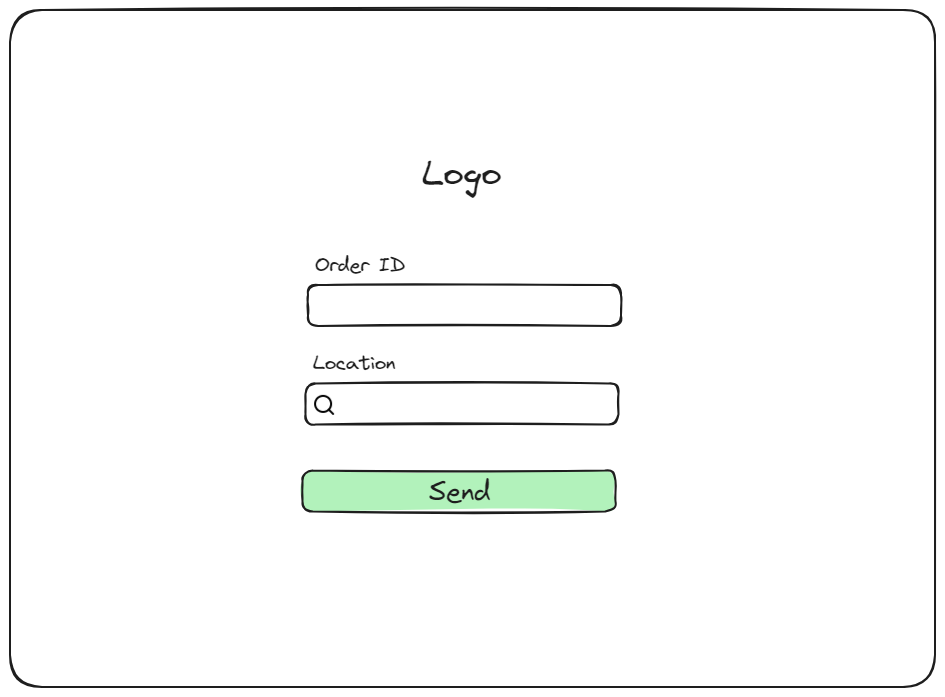
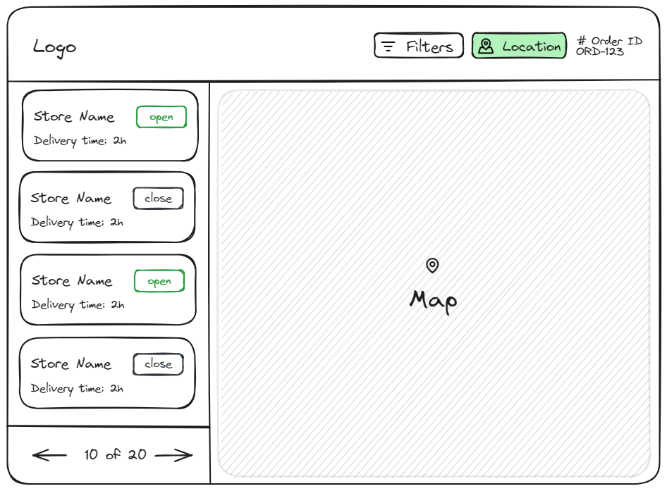

# InstaStore

## Tabla de Contenido

- [Descripción](#descripción)
- [Preguntas y Respuestas](#preguntas-y-respuestas)
- [Arquitectura de la Aplicación](#arquitectura-de-la-aplicación)
  - [Estructura del Proyecto](#estructura-del-proyecto)
- [Bocetos](#bocetos)
  - [Boceto de OrderFormView](#boceto-de-orderformview)
  - [Boceto de StoreView](#boceto-de-storeview)
- [Plan de Entrega](#plan-de-entrega)
- [Instrucciones de Ejecución](#instrucciones-de-ejecución)
  - [Clonar el Repositorio](#clonar-el-repositorio)
  - [Instalar Dependencias](#instalar-dependencias)
  - [Iniciar la Aplicación](#iniciar-la-aplicación)
  - [Compilar para Producción](#compilar-para-producción)
  - [Notas Adicionales](#notas-adicionales)
- [Mejoras y Compromisos](#mejoras-y-compromisos)
- [Bloqueos Encontrados](#bloqueos-encontrados)
- [Video de Demostración](#video-de-demostración)

## Descripción

InstaStore es una aplicación web diseñada para ayudar a nuestros clientes B2B a encontrar las tiendas de conveniencia más cercanas para la entrega de sus pedidos de comestibles. La aplicación permite a los usuarios ingresar un ID de pedido y una ubicación, luego muestra una lista de tiendas cercanas junto con un mapa interactivo.

### Características Principales:

- **Formulario de Pedido**: Los usuarios pueden ingresar el ID de su pedido y su ubicación.
- **Lista de Tiendas Cercanas**: Después de enviar el formulario, se muestra una lista de tiendas cercanas con detalles importantes.
- **Mapa Interactivo**: Un mapa que muestra la ubicación de las tiendas cercanas.
- **Barra de Navegación**: Incluye filtros y opciones para ajustar la búsqueda de tiendas.

La aplicación está desarrollada con React para asegurar una experiencia de usuario fluida y rápida, y utiliza tecnologías modernas para proporcionar una interfaz intuitiva y fácil de usar.

## Preguntas y Respuestas
Documentación de preguntas realizadas y sus respuestas.

**Por definir.**

## Arquitectura de la Aplicación

### Estructura del Proyecto

```text
instaStore/
├── public/
│   ├── instastore-icon.svg
│   └── ...
├── src/
│   ├── assets/
│   │   ├── images/
│   │   └── styles/
│   ├── utils/
│   │   ├── lib/
│   │   ├── hooks/
│   │   └── ...
│   ├── components/
│   │   ├── ui/
│   │   └── ...
│   ├── views/
│   │   └── ...
│   ├── App.tsx
│   ├── main.tsx
│   └── ...
├── .gitignore
├── package.json
├── README.md
├── ...
└── vite.config.ts
```

### Funcionamiento de la Aplicación

1. **Inicio**: El usuario accede a la aplicación y ve la `OrderFormView`.
2. **Ingreso del Pedido**: El usuario ingresa el ID del pedido y la ubicación en el formulario.
3. **Redirección a StoresView**: Después de enviar el formulario, la aplicación redirige a `StoresView`.
4. **Visualización de Tiendas**: En `StoresView`, el usuario puede ver una lista de tiendas cercanas y un mapa con las ubicaciones de las tiendas.


### Flujo de Datos

1. **OrderFormView**:
   - El formulario de pedido captura el ID del pedido y la ubicación.
   - La función `onOrderSubmit` maneja el envío del pedido y redirige a `StoresView`.

2. **StoresView**:
   - Obtiene los datos del pedido de un `global store` creado con `zustand`.
   - Utiliza los datos del pedido para obtener y mostrar las tiendas cercanas.
   - Muestra una lista de tiendas y un mapa con las ubicaciones.

Esta arquitectura modular permite mantener el código organizado y facilita el mantenimiento y la extensión de la aplicación.


## Bocetos

### Boceto de OrderFormView



**Descripción:**
El boceto de `OrderFormView` muestra la interfaz del formulario de pedido, que incluye el logo de la aplicación, un campo para ingresar el ID del pedido, un campo para la ubicación y un botón para enviar el formulario.

**Funcionamiento:**

1. El usuario ingresa el ID del pedido en el campo "Order ID".
2. El usuario ingresa su ubicación en el campo "Location".
3. El usuario hace clic en el botón "Send".
4. La aplicación procesa la información ingresada y redirige al usuario a la vista `StoresView`.

### Boceto de StoreView



**Descripción:**
El boceto de `StoreView` muestra la interfaz que aparece después de enviar el formulario de pedido, incluyendo una barra de navegación superior con filtros y opciones, una lista de tiendas cercanas con información sobre el estado de apertura y tiempo de entrega, y un mapa interactivo.

**Funcionamiento:**

1. La vista `StoresView` se muestra después de que el usuario envía el formulario en `OrderFormView`.
2. La barra de navegación superior permite al usuario aplicar filtros y ver su ubicación actual.
3. La lista de tiendas muestra las tiendas cercanas con su estado de apertura y tiempo de entrega.
4. El mapa interactivo muestra la ubicación de las tiendas en un contexto geográfico.

## Plan de Entrega

Se acordó que el proyecto estará listo para el miércoles 26.

## Instalación

Sigue estos pasos para configurar y ejecutar el proyecto en tu entorno local:

### Prerrequisitos

- [Node.js](https://nodejs.org/) (versión 14 o superior)
- [npm](https://www.npmjs.com/) (viene con Node.js) o [Yarn](https://yarnpkg.com/)

### Clonar el Repositorio

Clona el repositorio a tu máquina local utilizando Git:

```bash
git clone https://github.com/altguerrero/instaStore.git
cd InstaStore
```

### Instalar Dependencias

Instala las dependencias necesarias para el proyecto utilizando npm o Yarn:

Con npm:

```bash
npm install
```

Con npm:

```bash
yarn install
```

### Ejecutar la Aplicación

Inicia el servidor de desarrollo para ver la aplicación en funcionamiento:

```bash
npm run dev
```

Con npm:

```bash
yarn dev
```

Abre tu navegador y navega a la URL proporcionada en la terminal (generalmente http://localhost:3000, pero puede variar si ese puerto está ocupado).

### Compilar para Producción

Para crear una compilación optimizada para producción:

```bash
npm run build
```

Con npm:

```bash
yarn build
```

Esto generará los archivos compilados en la carpeta `dist`.

### Notas Adicionales

- Asegúrate de configurar las variables de entorno necesarias en un archivo .env en la raíz del proyecto.

## Mejoras y Compromisos
**Por definir.**

## Bloqueos Encontrados
**Por definir.**

## Video de Demostración
**Por definir.**